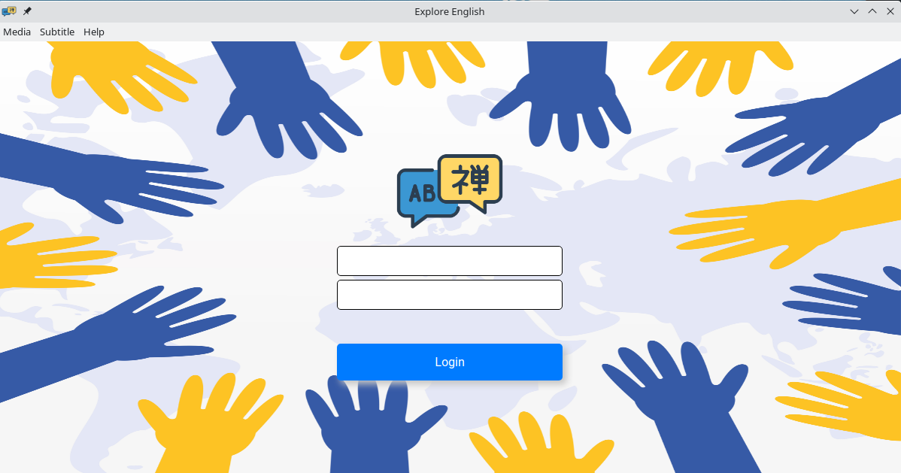
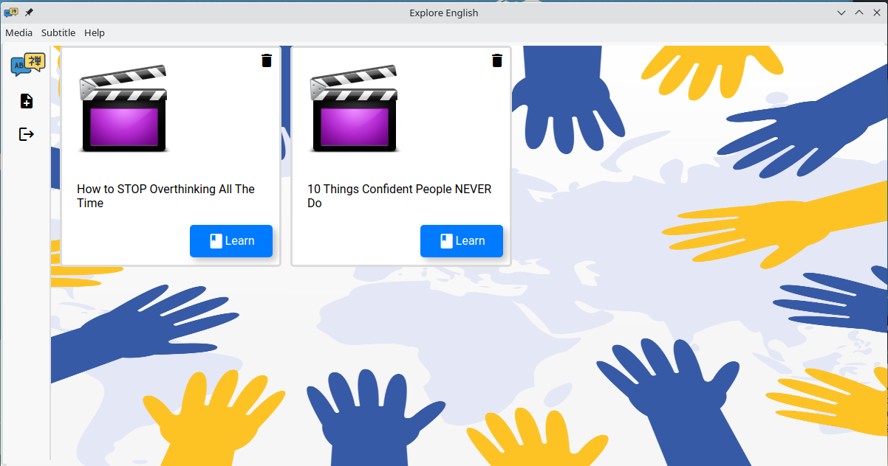
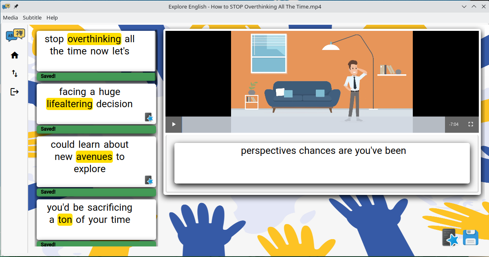

# Explore English 

Explore English is an app that help you to learn Enlgish. With it, you can studying watching a videos. If you don't understand some word, you can mark the word on the subtitle, sync to the API and create a card to Anki, an open source spaced repeat program.

## Features: 💡

- Watch videos located on computer;
- See subtitles;
- Mark words you don't know on subtitle;
- Sync marked words with the server;
- Create Anki cards automatically, with audio pronunciation.


## My intentions with this project:

- Learn frontend with React;
- Create a tool to help me and anyone with lern English;
- Training clean code concepts and unit tests on API's.

## Technologies: 🤖

- Electron;
- React;
- Express;
- Webpack;
- Babel;
- Jest;
- MongoDB;
- TypeScript;
- Swagger;
- Anki.

## How to Run this Project: 🚀

```bash
    cd backend
    docker-compose up -d # up api container with mongodb

    cd ..
    npm install
    npm run dev
```

## How to Execute Tests: 🧪
```bash
    cd backend
    npm run test
```


## How to Build a Debian Package: 🐧

```bash
    npm run build # build to production
    npm run package:deb # create .deb package
```
OBS.: .deb package will be on 

## Packages: 📦

Currently, this project there is packages for Debian and ArchLinux based distros:

| OS | Version | URL |
| :---: | :---: | :---: |
| ArchLinux | Alpha 4 | <a href="https://github.com/bruninho51/explore-english-electron/releases/download/alpha4/explore-english-1.0.0alpha.4-1-x86_64_archlinux.pkg.tar.zst">Download<a> |
| Debian | Alpha 4 | <a href="https://github.com/bruninho51/explore-english-electron/releases/download/alpha4/explore-english_1.0.0.alpha.4_amd64.deb">Download</a> |

## Screenshots: 📸

### Login:



### Home:



### Video Player:



<br/><br/>
Copyright 2022. All rights reserved to Bruno Mendes Pimenta.